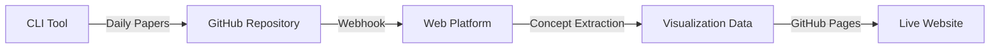

# Interactive Research Paper Discovery Platform

🔬 **Transform academic paper collections into intuitive visual concept maps**

An interactive web platform that uses machine learning and visualization to help researchers explore literature landscapes without technical barriers.

[](https://jdoner02.github.io/research-paper-discovery-web/)
[](./tests)
[](./src)
[](./tests)

## ✨ Features

### 🎯 **For Researchers**
- **Visual Concept Maps**: Interactive D3.js visualizations of research landscapes
- **Evidence-Based Navigation**: Click concepts to see supporting sentences from papers
- **Mobile-Responsive Design**: Full functionality on all devices
- **No Technical Barriers**: Form-based configuration, no command-line required

### 🔧 **For Developers**
- **Clean Architecture**: Strict layer separation with educational documentation
- **Test-Driven Development**: 95%+ test coverage with Red-Green-Refactor methodology
- **Comprehensive Documentation**: Every design decision explained
- **Professional Patterns**: Repository, Strategy, Factory, Adapter patterns demonstrated

## 🚀 Quick Start

### For End Users

1. **Visit the Live Platform**: [research-paper-discovery-web.github.io](https://jdoner02.github.io/research-paper-discovery-web/)
2. **Select Research Area**: Choose from available research domains
3. **Configure Search**: Check/uncheck search strategies
4. **Explore Concepts**: Navigate interactive concept maps
5. **Access Papers**: Click evidence sentences to read full papers

### For Developers

```bash
# Clone the repository
git clone https://github.com/jdoner02/research-paper-discovery-web.git
cd research-paper-discovery-web

# Install dependencies
npm install

# Run tests (TDD approach - run tests first!)
npm test

# Start development server
npm run dev

# Build for production
npm run build
npm run export
```

## 🏗️ Architecture

### Clean Architecture Layers

```
┌─────────────────────┐
│    Interface        │  Next.js UI, D3.js visualizations
├─────────────────────┤
│   Infrastructure    │  GitHub API, File System, ML Models
├─────────────────────┤  
│   Application       │  Use Cases, Ports
├─────────────────────┤
│     Domain          │  Entities, Value Objects, Services
└─────────────────────┘  Pure business logic
```

**Domain Layer** (`src/domain/`):
- `entities/`: Paper, ConceptNode, ConceptTree
- `value_objects/`: EmbeddingVector, EvidenceSentence, ConceptHierarchy
- `services/`: ConceptExtractionService, HierarchyBuilderService

**Application Layer** (`src/application/`):
- `use_cases/`: ExtractConceptsUseCase, BuildVisualizationDataUseCase
- `ports/`: Abstract interfaces for external dependencies

**Infrastructure Layer** (`src/infrastructure/`):
- `repositories/`: GitHub integration, JSON data storage
- `adapters/`: sentence-transformers, D3.js data formatting

**Interface Layer** (`src/interface/`):
- `web/`: Next.js components, API routes, pages
- `visualization/`: D3.js interactive concept maps

## 🧪 Test-Driven Development

We follow strict **Red-Green-Refactor** methodology:

### Test Pyramid Distribution
- **Unit Tests (70%)**: Domain and application layer isolation
- **Integration Tests (20%)**: Cross-layer component interaction
- **End-to-End Tests (10%)**: Complete user workflow validation

### Running Tests
```bash
# Run all tests
npm test

# Watch mode for TDD
npm run test:watch

# Coverage report
npm run test:coverage

# End-to-end tests
npm run test:e2e
```

### TDD Cycle Example
```bash
# 1. RED: Write failing test
npm test -- --testNamePattern="ConceptNode creation"

# 2. GREEN: Minimal implementation
# Edit src/domain/entities/concept-node.ts

# 3. REFACTOR: Improve while keeping tests green
npm test -- --coverage
```

## 🤖 Concept Extraction Technology

### Embeddings-Based Processing
- **Local Models**: sentence-transformers (no API costs)
- **Primary Model**: `all-MiniLM-L6-v2` (speed/quality balance)
- **Fallback Model**: `all-mpnet-base-v2` (higher quality)

### Hierarchical Concept Discovery
1. **Text Preprocessing**: Extract clean content from research papers
2. **Semantic Embedding**: Generate sentence-level meaning vectors
3. **Clustering**: HDBSCAN for semantic grouping
4. **Hierarchy Construction**: Recursive subdivision with coherence thresholds
5. **Evidence Mapping**: Link concepts to supporting sentences

### Reproducible Processing
- **Deterministic Results**: Fixed random seeds and model versions
- **Comprehensive Logging**: Full audit trail of processing steps
- **Quality Validation**: Coherence scoring and filtering
- **Performance Optimization**: Batch processing and embedding caching

## 🔄 Integration with CLI Tool

This web platform integrates with the [Research Paper Aggregator CLI tool](../research-paper-aggregator/):



### Data Flow
1. **CLI Tool**: Aggregates papers from ArXiv, PubMed, etc.
2. **GitHub Actions**: Triggers concept extraction pipeline
3. **Web Platform**: Processes papers into concept hierarchies
4. **Visualization**: Updates interactive concept maps
5. **GitHub Pages**: Deploys updated site automatically

## 📊 User Experience Design

### Target Personas
- **Academic Researchers**: Need efficient literature exploration
- **Graduate Students**: Seeking comprehensive topic understanding
- **Research Administrators**: Identifying collaboration opportunities

### Key User Journeys

**Quick Discovery (< 2 minutes)**:
```
Landing Page → Select Research Area → View Concept Map → Explore Papers
```

**Custom Configuration (< 10 minutes)**:
```
Configuration Builder → Select Strategies → Generate Search → Monitor Progress
```

**Deep Exploration (< 30 seconds per concept)**:
```
Concept Map → Click Node → Read Evidence → Open Paper
```

### Mobile-First Design
- **Touch-Friendly**: D3.js interactions optimized for mobile
- **Responsive Layout**: Consistent experience across all devices
- **Gesture Navigation**: Pinch, zoom, pan for concept exploration
- **Accessibility**: WCAG 2.1 AA compliance

## 🛠️ Development Workflow

### TDD Cycle Implementation

**Phase Structure** (8 planned TDD cycles):
1. **Core Domain Entities**: Paper, ConceptNode, ConceptTree
2. **Embeddings Processing**: sentence-transformers integration
3. **Hierarchical Clustering**: HDBSCAN concept organization
4. **Evidence Mapping**: Sentence-concept relationships
5. **Repository Integration**: CLI tool data access
6. **Web API Layer**: Next.js endpoint development
7. **D3.js Visualization**: Interactive concept maps
8. **Configuration Builder**: Form-based YAML generation

### Code Quality Standards
```bash
# Type checking
npm run type-check

# Linting
npm run lint

# Test coverage (must be > 95% for domain/application)
npm run test:coverage

# End-to-end validation
npm run test:e2e
```

### Educational Documentation
Every component includes:
- **Purpose Explanation**: Why this component exists
- **Pattern Demonstration**: Which design patterns are shown
- **Architecture Context**: How it fits in Clean Architecture
- **Real-World Application**: Academic research use cases
- **Extension Points**: How to add new features

## 🎓 Educational Value

### Design Patterns Demonstrated
- **Repository Pattern**: Abstract data access across sources
- **Strategy Pattern**: Pluggable concept extraction algorithms
- **Factory Pattern**: Dynamic component creation
- **Adapter Pattern**: External API integration
- **Observer Pattern**: Real-time visualization updates

### Software Engineering Practices
- **Clean Architecture**: Proper dependency direction and layer separation
- **Test-Driven Development**: Red-Green-Refactor discipline
- **Domain-Driven Design**: Rich domain model reflecting research concepts
- **Continuous Integration**: Automated testing and deployment
- **Documentation-Driven Development**: Comprehensive explanations

### Learning Outcomes
- Professional software architecture in a real-world context
- Machine learning integration with traditional web development
- User experience design for academic/technical audiences
- Performance optimization for interactive visualizations
- Deployment and DevOps practices with GitHub Actions

## 📈 Performance & Scalability

### Optimization Strategies
- **Batch Processing**: Efficient handling of large paper collections
- **Embedding Caching**: Avoid recomputing semantic vectors
- **Incremental Updates**: Process only new/changed papers
- **Lazy Loading**: Progressive visualization rendering
- **Web Workers**: Background concept extraction processing

### Performance Targets
- **Concept Extraction**: < 2 seconds for 100 papers
- **Visualization Rendering**: < 1 second for 1000 concepts
- **Mobile Interaction**: 60fps smooth animations
- **Initial Page Load**: < 3 seconds on 3G connection

## 🤝 Contributing

### Development Setup
1. **Fork the repository**
2. **Create feature branch**: `git checkout -b feature/amazing-feature`
3. **Write tests first**: Follow TDD Red-Green-Refactor
4. **Implement feature**: Keep tests passing
5. **Add documentation**: Explain architectural decisions
6. **Submit pull request**: Include test coverage and documentation

### Code Review Checklist
- [ ] Tests written before implementation (TDD)
- [ ] All tests passing with > 95% coverage
- [ ] Clean Architecture principles maintained
- [ ] Comprehensive documentation added
- [ ] Mobile responsiveness verified
- [ ] Accessibility standards met
- [ ] Performance impact assessed

## 📜 License

MIT License - see [LICENSE](LICENSE) file for details.

## 🙋‍♀️ Support

- **Issues**: [GitHub Issues](https://github.com/jdoner02/research-paper-discovery-web/issues)
- **Discussions**: [GitHub Discussions](https://github.com/jdoner02/research-paper-discovery-web/discussions)
- **Documentation**: [Development Instructions](.github/prompts/development-instructions.md)

---

**Built with ❤️ for the academic research community**

*This project demonstrates professional software development practices while solving genuine problems for researchers. Every architectural decision is made with both technical excellence and educational value in mind.*
