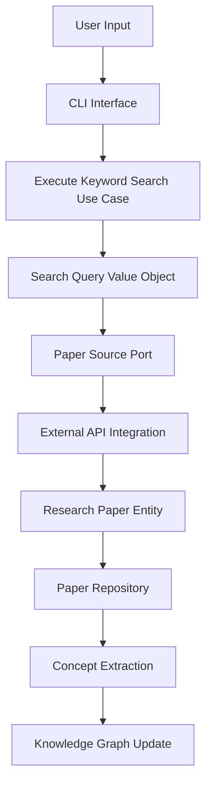
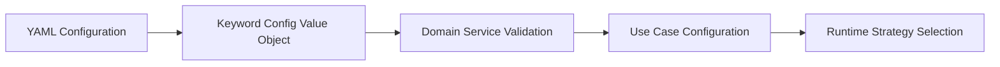
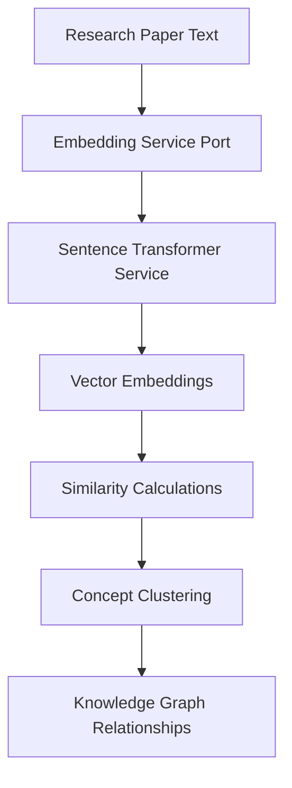
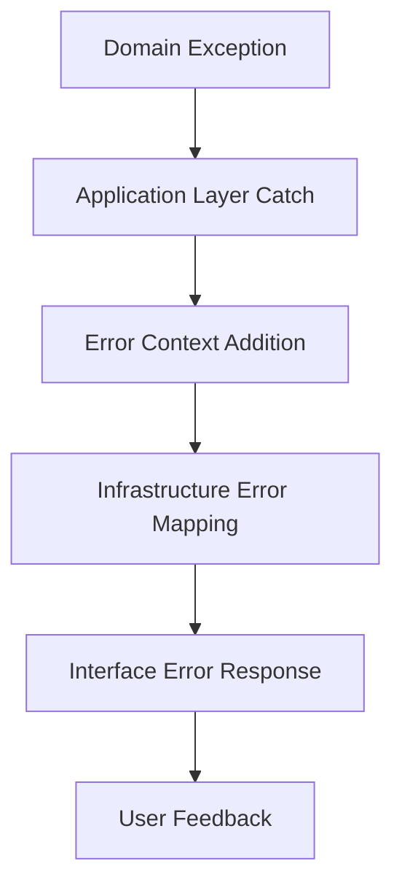

# Data Flow Architecture

> **Context**: Understanding how information moves through the Academic Paper Discovery System is crucial for both implementation and debugging. This document maps the complete data journey from user input to knowledge extraction.

## Overview

The Academic Paper Discovery System implements a **unidirectional data flow** pattern that ensures predictable state management and clear separation of concerns. Data flows through our [[Clean-Architecture-Implementation|clean architecture layers]] in a controlled manner.

## 🔄 Primary Data Flow Patterns

### 1. Research Query Flow



**Flow Details:**
1. **User Input** → **[[CLI-Interface]]**: Raw search parameters and configuration
2. **CLI** → **[[Execute-Keyword-Search-UseCase]]**: Validated command structure
3. **Use Case** → **[[Search-Query-ValueObject]]**: Immutable query representation
4. **Query** → **[[Paper-Source-Port]]**: Abstract search contract
5. **Port** → **[[External-API-Integration]]**: Concrete API implementation
6. **API** → **[[Research-Paper-Entity]]**: Structured domain objects
7. **Entity** → **[[Repository-Implementation]]**: Persistent storage
8. **Repository** → **[[Concept-Extraction]]**: Knowledge discovery process
9. **Extraction** → **Knowledge Graph**: Interconnected concept network

### 2. Configuration Data Flow



**Key Principles:**
- **Immutable Configuration**: [[Keyword-Config-ValueObject]] ensures configuration cannot be modified after creation
- **Validation at Boundaries**: Input validation happens at the interface layer
- **Strategy Pattern**: Runtime behavior modification through [[Research-Domain-Configuration]]

### 3. Embedding and Similarity Flow



## 🏗️ Architectural Flow Patterns

### Clean Architecture Data Movement

Our data flow respects the **Dependency Rule** from [[Clean-Architecture-Implementation]]:

```
📊 Data Flow Direction
┌─────────────────┐    ┌─────────────────┐    ┌─────────────────┐
│   Interface     │───▶│   Application   │───▶│     Domain      │
│   (CLI/Web)     │    │   (Use Cases)   │    │   (Entities)    │
└─────────────────┘    └─────────────────┘    └─────────────────┘
         ▲                       ▲                       ▲
         │                       │                       │
┌─────────────────┐              │              ┌─────────────────┐
│  Infrastructure │──────────────┘              │   Value Objects │
│ (Repositories)  │                             │  (Search Query) │
└─────────────────┘                             └─────────────────┘
```

**Critical Rules:**
- **Inward Dependencies**: Outer layers depend on inner layers, never the reverse
- **Port/Adapter Pattern**: Infrastructure implements domain-defined interfaces
- **Data Transformation**: Each layer transforms data to its appropriate representation

### Error Flow Handling



## 📋 Data Transformation Stages

### Stage 1: Input Parsing and Validation

**Location**: [[CLI-Interface]] and [[Web-Interface]]

```python
# Raw user input
user_input = "search heart rate variability traumatic brain injury"

# Parsed and validated
search_request = SearchQueryRequest(
    terms=["heart rate variability", "traumatic brain injury"],
    filters=DateRangeFilter(start_year=2020),
    domain_config="hrv_medical_research"
)
```

### Stage 2: Domain Object Creation

**Location**: [[Application-Services]]

```python
# Application layer transformation
search_query = SearchQuery.from_request(
    search_request,
    keyword_config=KeywordConfig.from_yaml_file(
        "config/hrv_medical_research.yaml"
    )
)
```

### Stage 3: Infrastructure Adaptation

**Location**: [[External-API-Integration]]

```python
# Infrastructure layer adaptation
api_query = external_api.transform_query(search_query)
raw_results = external_api.search(api_query)
domain_papers = [ResearchPaper.from_api_result(result) for result in raw_results]
```

### Stage 4: Knowledge Extraction

**Location**: [[Concept-Extraction]]

```python
# Concept extraction and relationship discovery
concepts = concept_extractor.extract_concepts(domain_papers)
relationships = relationship_analyzer.find_relationships(concepts)
knowledge_graph.update(concepts, relationships)
```

## 🔍 Data Flow Monitoring

### Observability Points

1. **Input Validation Metrics**: Track malformed requests and validation failures
2. **API Response Times**: Monitor external service performance
3. **Concept Extraction Success**: Measure knowledge discovery effectiveness  
4. **Cache Hit Rates**: Monitor [[Caching-Strategy]] effectiveness

### Flow Debugging Strategies

```python
@dataclass
class DataFlowTracer:
    """Educational example of data flow monitoring."""
    
    def trace_search_flow(self, search_query: SearchQuery) -> FlowTrace:
        trace = FlowTrace(query_id=generate_id())
        
        # Trace each transformation
        trace.add_checkpoint("query_created", search_query)
        trace.add_checkpoint("api_called", api_response)
        trace.add_checkpoint("papers_parsed", domain_papers)
        trace.add_checkpoint("concepts_extracted", concepts)
        
        return trace
```

## 🎓 Educational Value

### Design Patterns Demonstrated

1. **Pipeline Pattern**: Sequential data transformation stages
2. **Chain of Responsibility**: Error handling through layers
3. **Observer Pattern**: Data flow monitoring and logging
4. **Strategy Pattern**: Configurable data processing strategies

### Learning Outcomes

After studying this data flow architecture, students will understand:

- How clean architecture maintains data flow integrity
- Why unidirectional flow reduces system complexity
- How to implement effective error propagation
- Strategies for monitoring and debugging data transformations

## 🔗 Related Concepts

- [[System-Architecture]]: Overall system design context
- [[Clean-Architecture-Implementation]]: Architectural principles governing data flow
- [[Security-Architecture]]: How security measures integrate with data flow
- [[Module-Boundaries]]: Component interfaces that data crosses
- [[Error-Handling-Strategy]]: Comprehensive error management approach

## 🚀 Implementation Guidelines

### For New Developers

1. **Start with Use Cases**: Understand business logic before implementation details
2. **Follow the Flow**: Trace data from interface to domain and back
3. **Respect Boundaries**: Never bypass architectural layers
4. **Add Monitoring**: Instrument new data flows for observability

### For Architects

1. **Maintain Unidirectional Flow**: Prevent circular dependencies
2. **Design for Testability**: Each transformation should be unit testable
3. **Plan for Scale**: Consider data volume and processing requirements
4. **Document Decisions**: Record architectural trade-offs and rationale

---

*This data flow architecture enables the Academic Paper Discovery System to process research queries efficiently while maintaining clean separation of concerns and providing excellent debugging capabilities.*

#architecture #data-flow #clean-architecture #educational
