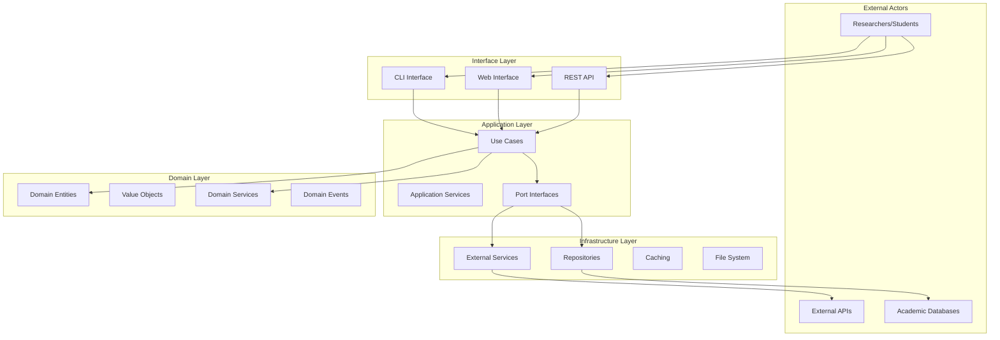
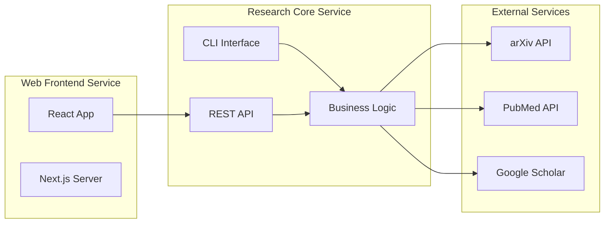

# System Architecture - Academic Paper Discovery Platform

## 🏗️ Architectural Overview

The Academic Paper Discovery Platform follows **Clean Architecture** principles with clear separation of concerns, dependency inversion, and modular design. This architecture serves as both a production-ready system and a pedagogical exemplar of industry best practices.

## 🎯 Architectural Principles

### 1. Clean Architecture (Uncle Bob's Architecture)
- **Independence**: Business logic independent of frameworks, UI, and external concerns
- **Testability**: All layers can be tested in isolation
- **Framework Independence**: Not tied to specific technologies
- **Database Independence**: Business logic doesn't depend on data storage details
- **External Agency Independence**: Business rules don't know about external interfaces

### 2. Domain-Driven Design (DDD)
- **Ubiquitous Language**: Shared vocabulary between domain experts and developers
- **Bounded Contexts**: Clear boundaries between different problem domains
- **Rich Domain Models**: Business logic expressed through domain objects
- **Event-Driven Communication**: Loose coupling through domain events

### 3. SOLID Principles
- **Single Responsibility**: Each class has one reason to change
- **Open/Closed**: Open for extension, closed for modification
- **Liskov Substitution**: Derived classes must be substitutable for base classes
- **Interface Segregation**: Many specific interfaces better than one general interface
- **Dependency Inversion**: Depend on abstractions, not concretions

## 🏢 System Structure

### High-Level Architecture



## 📁 Project Structure Refactor

### Current State (Mixed Architecture)
```
research-paper-aggregator/
├── main.py                 # Root-level script
├── search_cli.py           # Another root-level script
├── batch_processor.py      # Yet another root script
├── src/                    # Partial Clean Architecture
│   ├── domain/
│   ├── application/
│   └── infrastructure/
├── pages/                  # Next.js mixed with backend
├── config/                 # Domain configurations
└── docs/                   # Minimal documentation
```

### Target State (Clean Separation)
```
research-paper-aggregator/
├── research-core/          # Python Backend (Clean Architecture)
│   ├── src/
│   │   ├── domain/         # Business logic core
│   │   ├── application/    # Use cases and ports
│   │   ├── infrastructure/ # External integrations
│   │   └── interface/      # CLI and API interfaces
│   ├── tests/              # Comprehensive test suite
│   ├── pyproject.toml      # Python dependencies
│   └── Dockerfile          # Containerization
├── research-web/           # Next.js Frontend
│   ├── src/
│   │   ├── components/     # React components
│   │   ├── pages/          # Next.js pages
│   │   ├── hooks/          # Custom React hooks
│   │   └── services/       # API client services
│   ├── public/             # Static assets
│   ├── package.json        # Node.js dependencies
│   └── Dockerfile          # Frontend containerization
├── shared/                 # Common utilities and configuration
│   ├── config/             # Domain-specific YAML configs
│   ├── schemas/            # API and data schemas
│   └── scripts/            # Build and deployment scripts
├── docs/                   # Comprehensive knowledge graph
├── docker-compose.yml      # Local development environment
└── README.md               # Project overview
```

## 🔄 Layer Architecture Details

### 1. Domain Layer (Core Business Logic)

**Location**: `research-core/src/domain/`

**Responsibilities**:
- Define core business entities and their behavior
- Implement business rules and invariants
- Provide domain services for complex business operations
- Emit domain events for significant business occurrences

**Key Components**:

#### Entities
```python
# research-core/src/domain/entities/research_paper.py
class ResearchPaper:
    """Core domain entity representing an academic paper."""
    
    def __init__(self, doi: DOI, title: str, authors: List[Author]):
        self._doi = doi
        self._title = title
        self._authors = authors
        self._concepts: List[Concept] = []
    
    def extract_concepts(self, extractor: ConceptExtractor) -> None:
        """Business logic for concept extraction."""
        self._concepts = extractor.extract_from_abstract(self._abstract)
        self._emit_event(ConceptsExtractedEvent(self._doi, self._concepts))
```

#### Value Objects
```python
# research-core/src/domain/value_objects/search_query.py
@dataclass(frozen=True)
class SearchQuery:
    """Immutable search parameters with validation."""
    
    terms: Tuple[str, ...]
    domain: Optional[str] = None
    date_range: Optional[DateRange] = None
    
    def __post_init__(self):
        if not self.terms:
            raise ValueError("Search terms cannot be empty")
```

#### Domain Services
```python
# research-core/src/domain/services/similarity_calculator.py
class SimilarityCalculator:
    """Domain service for paper similarity computation."""
    
    def calculate_semantic_similarity(
        self, 
        paper1: ResearchPaper, 
        paper2: ResearchPaper
    ) -> SimilarityScore:
        """Calculate semantic similarity between papers."""
        # Complex business logic for similarity calculation
```

**Related Documentation**: [[Research-Paper-Entity]], [[Search-Query-ValueObject]], [[Domain-Services]]

### 2. Application Layer (Use Cases & Orchestration)

**Location**: `research-core/src/application/`

**Responsibilities**:
- Orchestrate domain objects to fulfill use cases
- Define ports (interfaces) for external dependencies
- Handle application-level concerns (transactions, security)
- Coordinate between domain and infrastructure layers

**Key Components**:

#### Use Cases
```python
# research-core/src/application/use_cases/discover_papers_use_case.py
class DiscoverPapersUseCase:
    """Orchestrates paper discovery workflow."""
    
    def __init__(
        self,
        paper_repository: PaperRepositoryPort,
        search_service: SearchServicePort,
        config_repository: ConfigRepositoryPort
    ):
        self._paper_repository = paper_repository
        self._search_service = search_service
        self._config_repository = config_repository
    
    async def execute(self, command: DiscoverPapersCommand) -> PaperCollection:
        """Execute paper discovery use case."""
        config = await self._config_repository.get_domain_config(command.domain)
        query = SearchQuery.from_config(command.terms, config)
        papers = await self._search_service.search(query)
        
        # Apply domain-specific ranking and filtering
        ranked_papers = self._apply_domain_ranking(papers, config)
        
        # Store results for future reference
        collection = PaperCollection(papers=ranked_papers)
        await self._paper_repository.save_collection(collection)
        
        return collection
```

#### Port Interfaces
```python
# research-core/src/application/ports/paper_repository_port.py
from abc import ABC, abstractmethod

class PaperRepositoryPort(ABC):
    """Port interface for paper persistence."""
    
    @abstractmethod
    async def find_by_doi(self, doi: DOI) -> Optional[ResearchPaper]:
        """Find paper by DOI."""
        pass
    
    @abstractmethod
    async def save_collection(self, collection: PaperCollection) -> None:
        """Save paper collection."""
        pass
```

**Related Documentation**: [[Paper-Discovery-UseCase]], [[Port-Interfaces]], [[Application-Services]]

### 3. Infrastructure Layer (External Integrations)

**Location**: `research-core/src/infrastructure/`

**Responsibilities**:
- Implement port interfaces with concrete technologies
- Handle external API integrations
- Manage data persistence and caching
- Provide technical infrastructure services

**Key Components**:

#### Repository Implementations
```python
# research-core/src/infrastructure/repositories/postgresql_paper_repository.py
class PostgreSQLPaperRepository(PaperRepositoryPort):
    """PostgreSQL implementation of paper repository."""
    
    def __init__(self, connection_pool: asyncpg.Pool):
        self._pool = connection_pool
    
    async def find_by_doi(self, doi: DOI) -> Optional[ResearchPaper]:
        """Find paper by DOI in PostgreSQL."""
        async with self._pool.acquire() as conn:
            row = await conn.fetchrow(
                "SELECT * FROM papers WHERE doi = $1", 
                str(doi)
            )
            return self._map_to_domain(row) if row else None
```

#### External Service Adapters
```python
# research-core/src/infrastructure/services/arxiv_search_service.py
class ArxivSearchService(SearchServicePort):
    """arXiv API integration for paper search."""
    
    async def search(self, query: SearchQuery) -> List[ResearchPaper]:
        """Search papers using arXiv API."""
        arxiv_query = self._translate_to_arxiv_format(query)
        response = await self._http_client.get(f"arxiv.org/api/query?{arxiv_query}")
        return self._parse_arxiv_response(response)
```

**Related Documentation**: [[Repository-Implementation]], [[External-API-Integration]], [[Caching-Strategy]]

### 4. Interface Layer (User Interactions)

**Location**: `research-core/src/interface/` and `research-web/src/`

**Responsibilities**:
- Provide user interfaces (CLI, Web, API)
- Handle user input validation and formatting
- Translate between external formats and domain objects
- Manage session state and user preferences

**Key Components**:

#### CLI Interface
```python
# research-core/src/interface/cli/search_command.py
@click.command()
@click.argument('terms', nargs=-1, required=True)
@click.option('--domain', help='Research domain configuration')
@click.option('--format', default='table', help='Output format')
def search(terms: tuple, domain: str, format: str):
    """Search for academic papers."""
    command = DiscoverPapersCommand(
        terms=list(terms),
        domain=domain,
        output_format=format
    )
    
    result = discover_papers_use_case.execute(command)
    presenter = OutputPresenterFactory.create(format)
    presenter.present(result)
```

#### REST API
```python
# research-core/src/interface/api/papers_controller.py
from fastapi import FastAPI, Depends

@app.post("/api/v1/papers/search")
async def search_papers(
    request: SearchPapersRequest,
    use_case: DiscoverPapersUseCase = Depends(get_discover_papers_use_case)
) -> SearchPapersResponse:
    """REST endpoint for paper search."""
    command = DiscoverPapersCommand.from_request(request)
    result = await use_case.execute(command)
    return SearchPapersResponse.from_domain(result)
```

#### Web Interface
```typescript
// research-web/src/components/PaperSearch.tsx
const PaperSearch: React.FC = () => {
    const [query, setQuery] = useState<SearchQuery>();
    const [results, setResults] = useState<Paper[]>([]);
    
    const handleSearch = async (searchTerms: string[]) => {
        const response = await paperService.searchPapers({
            terms: searchTerms,
            domain: selectedDomain
        });
        setResults(response.papers);
    };
    
    return (
        <SearchInterface 
            onSearch={handleSearch}
            results={results}
            configurations={domainConfigurations}
        />
    );
};
```

**Related Documentation**: [[CLI-Interface]], [[Web-Interface]], [[API-Design]]

## 🔗 Dependency Flow

### Dependency Rule
Dependencies point inward toward the domain layer:

```
Interface Layer    ──→    Application Layer
     ↓                          ↓
Infrastructure Layer ──→    Domain Layer
```

**Key Principles**:
1. **Domain Layer** depends on nothing external
2. **Application Layer** depends only on Domain Layer
3. **Infrastructure Layer** implements Application Layer ports
4. **Interface Layer** depends on Application Layer use cases

### Dependency Injection
```python
# research-core/src/interface/dependency_injection.py
class DIContainer:
    """Dependency injection container."""
    
    def configure_dependencies(self) -> None:
        # Infrastructure layer
        self._container.bind(
            PaperRepositoryPort, 
            PostgreSQLPaperRepository(self._db_pool)
        )
        self._container.bind(
            SearchServicePort,
            ArxivSearchService(self._http_client)
        )
        
        # Application layer
        self._container.bind(
            DiscoverPapersUseCase,
            DiscoverPapersUseCase(
                self._container.get(PaperRepositoryPort),
                self._container.get(SearchServicePort),
                self._container.get(ConfigRepositoryPort)
            )
        )
```

## 🧪 Testing Strategy by Layer

### Domain Layer Testing
```python
# tests/unit/domain/test_research_paper.py
class TestResearchPaper:
    """Test domain entity behavior."""
    
    def test_extract_concepts_emits_domain_event(self):
        """Test that concept extraction emits proper domain event."""
        paper = ResearchPaper(DOI("10.1000/test"), "Test Paper", [])
        extractor = MockConceptExtractor()
        
        paper.extract_concepts(extractor)
        
        events = paper.get_uncommitted_events()
        assert len(events) == 1
        assert isinstance(events[0], ConceptsExtractedEvent)
```

### Application Layer Testing
```python
# tests/unit/application/test_discover_papers_use_case.py
class TestDiscoverPapersUseCase:
    """Test use case orchestration."""
    
    async def test_execute_applies_domain_configuration(self):
        """Test that use case applies domain-specific configuration."""
        # Arrange
        mock_repo = Mock(spec=PaperRepositoryPort)
        mock_search = Mock(spec=SearchServicePort)
        mock_config = Mock(spec=ConfigRepositoryPort)
        
        use_case = DiscoverPapersUseCase(mock_repo, mock_search, mock_config)
        command = DiscoverPapersCommand(["AI security"], "cybersecurity")
        
        # Act
        await use_case.execute(command)
        
        # Assert
        mock_config.get_domain_config.assert_called_with("cybersecurity")
```

### Integration Testing
```python
# tests/integration/test_paper_discovery_workflow.py
class TestPaperDiscoveryWorkflow:
    """Test complete paper discovery workflow."""
    
    async def test_end_to_end_paper_search(self):
        """Test complete search workflow with real dependencies."""
        # Test with real database and external APIs
        container = create_test_container()
        use_case = container.get(DiscoverPapersUseCase)
        
        result = await use_case.execute(
            DiscoverPapersCommand(["machine learning"], "ai_security")
        )
        
        assert len(result.papers) > 0
        assert all(paper.domain == "ai_security" for paper in result.papers)
```

**Related Documentation**: [[Testing-Strategy]], [[Unit-Testing-Patterns]], [[Integration-Testing]]

## 🚀 Deployment Architecture

### Containerized Deployment
```yaml
# docker-compose.yml
version: '3.8'
services:
  research-api:
    build: ./research-core
    ports:
      - "8000:8000"
    environment:
      - DATABASE_URL=postgresql://user:pass@db:5432/research
      - REDIS_URL=redis://cache:6379
    depends_on:
      - db
      - cache
  
  research-web:
    build: ./research-web
    ports:
      - "3000:3000"
    environment:
      - NEXT_PUBLIC_API_URL=http://research-api:8000
    depends_on:
      - research-api
  
  db:
    image: postgres:14
    environment:
      - POSTGRES_DB=research
      - POSTGRES_USER=user
      - POSTGRES_PASSWORD=pass
    volumes:
      - postgres_data:/var/lib/postgresql/data
  
  cache:
    image: redis:7
    volumes:
      - redis_data:/data
```

### Microservice Boundaries


**Related Documentation**: [[Containerization]], [[CI-CD-Pipeline]], [[Environment-Management]]

## 📊 Quality Attributes

### Performance Requirements
- **Response Time**: Search results within 3 seconds
- **Throughput**: Handle 100 concurrent searches
- **Scalability**: Horizontal scaling with load balancers
- **Efficiency**: Memory usage under 512MB per service instance

### Reliability Requirements
- **Availability**: 99.9% uptime (8.77 hours downtime per year)
- **Fault Tolerance**: Graceful degradation when external APIs fail
- **Recovery**: Automatic recovery from transient failures
- **Data Integrity**: Zero data loss during normal operations

### Security Requirements
- **Authentication**: API key-based authentication for programmatic access
- **Authorization**: Role-based access control for configuration management
- **Data Protection**: Encryption in transit and at rest
- **Privacy**: No storage of user search history without explicit consent

**Related Documentation**: [[Security-Architecture]], [[Monitoring-Observability]], [[Backup-Recovery]]

## 🔄 Evolution and Extension Points

### Configuration System Extensions
- **New Domains**: Add YAML configurations without code changes
- **Custom Strategies**: User-defined search and ranking algorithms
- **A/B Testing**: Compare configuration effectiveness
- **Machine Learning**: AI-powered configuration optimization

### Integration Extensions
- **New Academic APIs**: Plugin architecture for additional data sources
- **Reference Managers**: Extended export format support
- **Workflow Tools**: Integration with research management platforms
- **AI Services**: Additional NLP and ML service providers

### Interface Extensions
- **Mobile App**: React Native or native mobile applications
- **Voice Interface**: Voice-controlled paper discovery
- **Jupyter Integration**: Notebooks for interactive research exploration
- **IDE Plugins**: Integration with VS Code and other development environments

## 🔗 Related Documentation

- **[[Clean-Architecture-Implementation]]**: Detailed implementation patterns
- **[[Module-Boundaries]]**: Component separation and interfaces
- **[[Data-Flow]]**: Information flow through system layers
- **[[Security-Architecture]]**: Security patterns and principles
- **[[Testing-Strategy]]**: Quality assurance across all layers

---

*This architecture serves as both a production-ready system design and a comprehensive educational example of Clean Architecture principles applied to academic research workflows.*
